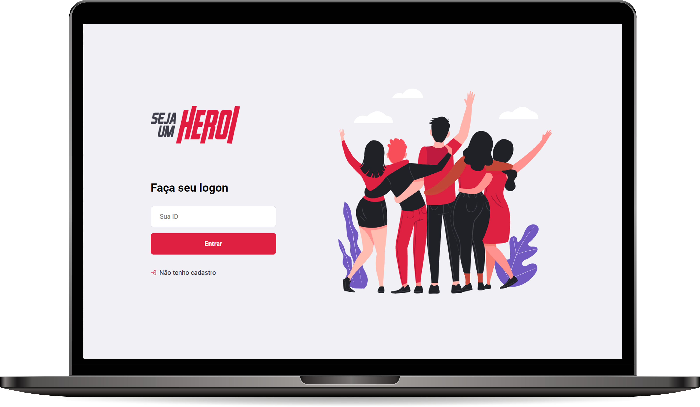

<p align="center">
  
</p>

# 

<br>

<p align="center">
  <a href="#Descrição-">Descrição</a>&nbsp;&nbsp;&nbsp;|&nbsp;&nbsp;&nbsp;
  <a href="#Tecnologias">Tecnologias</a>&nbsp;&nbsp;&nbsp;|&nbsp;&nbsp;&nbsp;
  <a href="#Teste">Teste</a>&nbsp;&nbsp;&nbsp;|&nbsp;&nbsp;&nbsp;
</p>

<br>
  
<br>

## Descrição

A aplicação **Seja um Herói** é direcionada a auxiliar ONGs a encontrar financiadores (Heróis) que possam custear um contratempo especifico, conectando pessoas e propósitos. Foi um projeto feito em conjunto com [Rocketseat](https://github.com/Rocketseat) :rocket: na Semana OmniStack 11.0.

<br>

## Tecnologias

Para a criação dessa aplicação foram utilizados as seguintes tecnologias:

- [Node.js](https://nodejs.org/en/);
- [Express](https://expressjs.com/);
- [Axios](https://github.com/axios/axios);
- [ReactJS](https://reactjs.org);
- [React Native](https://facebook.github.io/react-native/);
- [Expo](https://github.com/expo/).
<br>

## Teste

Para testar a aplicação, basta clonar esse repositório execultando o comando:
```sh
https://github.com/georgaugusto/seja-um-heroi.git
```

Em seguida acessar a pasta backend e executar o comando: ``` npm start ```

repetir o passo para acessar a pasta frontend e também executar os comando:
```sh
npm install
npm start
```

Agora para testar a versão mobile acessar a pasta mobile e execultar o comando: ``` npm start ```
